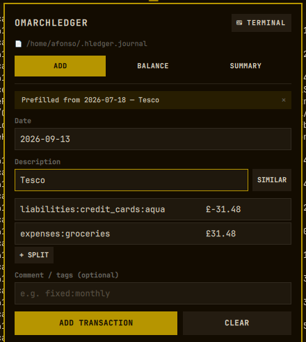

# Omarchledger

A bar plugin for [Omarchy](https://omarchy.org/) that puts your
[hledger](https://hledger.org/) ledger one click away: quick-add transactions
with autocomplete, your balance sheet, and journal statistics — all in a
keyboard-driven popup panel.



## Features

**Add tab** — a form that mirrors `hledger add`:

- **Description autocomplete** from your transaction history
  (`hledger descriptions`). Accepting a suggestion automatically offers
  **"use similar"**: the most recent transaction with that description is
  fetched and all its postings (with amounts) prefill the form, just like
  `hledger add`'s similar-transaction prompt.
- **Any number of postings** — use `+ SPLIT` for split transactions. The last
  posting may be left without an amount; hledger auto-balances it.
- **Account autocomplete** from your chart of accounts (`hledger accounts`).
- Optional **comment / tags** line (rendered as `; your tags`).
- Every transaction is **validated with `hledger check` before it is
  appended** — an invalid entry (unbalanced, unknown account, bad amount…)
  shows hledger's error message and writes nothing.
- Made a mistake? Every add offers an **UNDO** button (works as long as the
  journal file hasn't changed since).

**Balance tab** — your `hledger bs` balance sheet with Assets / Liabilities
sections, negatives highlighted, and the Net total accented.

**Summary tab** — `hledger stats` as a clean key/value table; a stale
journal ("Last txn … days ago") is highlighted.

### Keyboard flow

| Key | Action |
| --- | --- |
| `1` `2` `3` / `←` `→` | switch tab (when no field is focused) |
| `Enter` (no field focused) | start filling the form (focuses the date) |
| `r` | refresh Balance/Summary |
| `u` | undo the last add, when offered |
| `Tab` / `Shift+Tab` | next / previous field |
| `↑` `↓` / `Enter` | navigate / accept autocomplete |
| `Enter` (on last amount) | add the transaction |
| `Esc` | close suggestions, then the panel |

The header also has a **⌨ TERMINAL** button that opens real `hledger add` in
a terminal for anything the form doesn't cover.

## Requirements

- Omarchy (built and tested against the Omarchy shell / Quickshell)
- [`hledger`](https://hledger.org/install.html) on `PATH`

## Install

```
omarchy plugin add https://github.com/afonsoneto/omarchledger.git --enable
```

Then click the money icon in the bar's right section.

## Configuration

The journal and binary are discovered automatically — `LEDGER_FILE` (and
hledger's `~/.hledger.journal` default) are honored; nothing is hardcoded.
Two optional settings can be set on the widget's entry in
`~/.config/omarchy/shell.json` if you need overrides:

```jsonc
"right": [
  {
    "id": "afonsoneto.omarchledger",
    "hledgerBin": "/custom/path/to/hledger",  // default: command -v hledger
    "journalFile": "/custom/path/to/ledger.journal"  // default: hledger files (line 1)
  }
]
```

## How writes stay safe

The plugin never edits your journal directly on a best-effort basis. The
proposed transaction is appended to a temporary copy of the journal (in the
journal's own directory, so relative `include` directives keep working) and
validated with `hledger check`. Only if that passes is the entry appended to
the real journal. The UNDO button truncates the journal back to its exact
previous size and refuses to run if the file changed in the meantime.

## Publishing

To submit this plugin to the Omarchy plugin marketplace, open the
[submit-plugin issue form](https://github.com/omacom/omarchy-plugin-marketplace)
with this repository's URL, a category and tags.

## License

[MIT](LICENSE)
