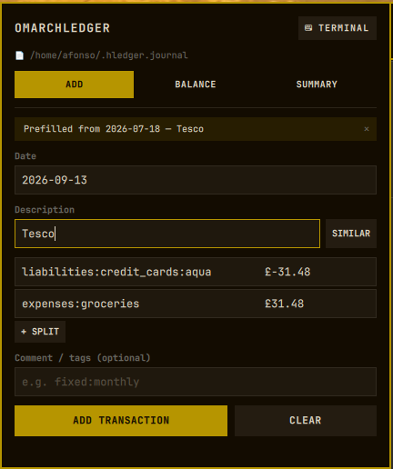
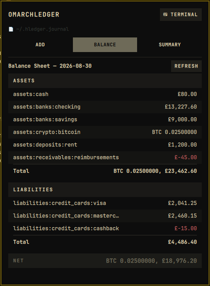
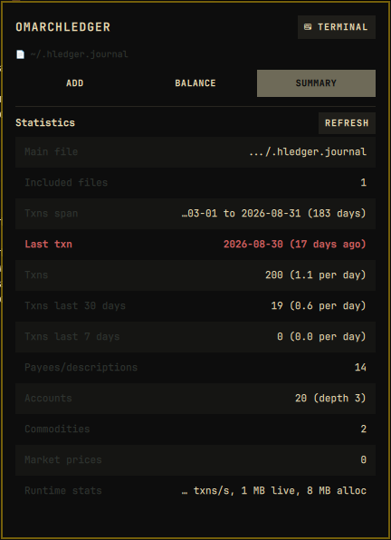

# Omarchledger

> An [Omarchy](https://omarchy.org/) bar plugin that puts your
> [hledger](https://hledger.org/) plain-text accounting one click away —
> quick-add transactions with autocomplete, your balance sheet, and journal
> statistics, all in a keyboard-driven popup panel.

## Features

### Add tab

A form that mirrors `hledger add`, right from the bar:

- **Description autocomplete** from your journal history
  (`hledger descriptions`). Accepting a suggestion offers **"use similar"**:
  the most recent matching transaction is fetched and its postings prefill the
  form — just like `hledger add`'s similar-transaction prompt.
- **Account autocomplete** from your chart of accounts (`hledger accounts`).
- **Any number of postings** — use `+ SPLIT` for split transactions. The last
  posting may be left without an amount; hledger auto-balances it.
- **Live auto-balancing** — edit any posting's amount and the next posting
  updates as you type so the transaction always sums to zero. Works on
  prefilled and manually built transactions; empty amounts count as zero and
  cost/lot expressions (e.g. `1 BTC @ £45500.25`) are left untouched.
- Optional **comment / tags** line (rendered as `; your tags`).
- Every transaction is **validated with `hledger check` before it is
  appended** — an invalid entry (unbalanced, unknown account, bad amount…)
  shows hledger's error message and writes nothing.
- Made a mistake? Every add offers an **UNDO** button (works as long as the
  journal file hasn't changed since).

### Balance tab

Your `hledger bs` balance sheet with Assets / Liabilities sections, negatives
highlighted in red, and the Net total accented.

### Summary tab

`hledger stats` as a clean key/value table; a stale journal ("Last txn … days
ago") is highlighted.

## Screenshots

| Add | Balance | Summary |
| --- | ------- | ------- |
|  |  |  |

**Add** — description autocomplete accepted, postings prefilled via "use
similar" from the most recent matching transaction.

**Balance** — structured balance sheet, negatives in red.

**Summary** — journal stats at a glance, stale journals flagged.

## Keyboard shortcuts

| Key | Action |
| --- | --- |
| `1` `2` `3` / `←` `→` | Switch tab (when no field is focused) |
| `Enter` (no field focused) | Start filling the form (focuses the date) |
| `r` | Refresh Balance / Summary |
| `u` | Undo the last add (when offered) |
| `Tab` / `Shift+Tab` | Next / previous field |
| `↑` `↓` / `Enter` | Navigate / accept autocomplete |
| `Enter` (on last amount) | Add the transaction |
| `Esc` | Close suggestions, then the panel |

The header also has a **⌨ TERMINAL** button that opens real `hledger add` in
a terminal for anything the form doesn't cover.

## Requirements

- [Omarchy](https://omarchy.org/) Quattro (tested with Omarchy 4.x / Quickshell 0.3.x)
- [`hledger`](https://hledger.org/install.html) on `PATH`

## Installation

```bash
omarchy plugin add https://github.com/AfonsoNeto/omarchledger.git --enable
```

Then click the ⚖ icon in the bar's right section.

> [!TIP]
> After installation, `omarchy restart shell` may be needed on some systems
> for the bar icon to appear.

## Uninstallation

To remove the plugin:

```bash
omarchy plugin remove afonsoneto.omarchledger
```

Or to temporarily disable it without deleting the files:

```bash
omarchy plugin disable afonsoneto.omarchledger
```

## Configuration

The journal file and hledger binary are **discovered automatically** —
`LEDGER_FILE`, hledger's `~/.hledger.journal` default, and `command -v hledger`
are all honored. Nothing is hardcoded.

Two optional overrides can be set on the widget's entry in
`~/.config/omarchy/shell.json`:

```jsonc
"right": [
  {
    "id": "afonsoneto.omarchledger",
    "hledgerBin": "/custom/path/to/hledger",      // default: command -v hledger
    "journalFile": "/custom/path/to/ledger.journal" // default: hledger files (line 1)
  }
]
```

## How writes stay safe

This plugin takes journal integrity seriously:

1. The proposed transaction is appended to a **temporary copy** of the journal
   (created in the journal's own directory, so relative `include` directives
   keep working) and validated with `hledger check`.
2. **Only if validation passes** is the entry appended to the real journal.
   On failure, hledger's error message is shown verbatim and nothing is
   written.
3. The **UNDO** button records the journal's exact byte size before and after
   the append. It truncates the journal back to its previous size and
   **refuses to run** if the file has changed in the meantime — it can never
   clobber later edits.
4. Temporary files are always cleaned up, even on failure.
5. Transaction data **never appears on a command line**. The entry is piped
   to the helper script's stdin (only a line count travels as an argument),
   so it can't leak through `/proc/<pid>/cmdline`, which is readable by other
   local users. Validation temp files are created with `mktemp` under a
   restrictive `umask` (0600).

## Security & permissions

> [!IMPORTANT]
> Omarchy plugins run **unsandboxed** with your user permissions. This plugin:
>
> - **Reads** your hledger journal to display balances, stats, descriptions,
>   and accounts.
> - **Appends** to your journal when you submit a transaction (never edits
>   existing content).
> - **Truncates** the journal only when you explicitly press UNDO, and only if
>   the file hasn't changed since the last add.
> - Runs `hledger` and standard coreutils (`stat`, `truncate`, `mktemp`)
>   via bash. Journal content is passed to the helper over stdin, never as
>   command-line arguments or environment variables.
> - **Does not** access the network, run background daemons, or execute
>   anything outside the commands listed above.
>
> You can audit the complete source — it's three QML files with embedded bash
> scripts, no build step, no dependencies beyond hledger.

## Project structure

```
afonsoneto.omarchledger/
├── manifest.json        # Plugin manifest (schemaVersion 1)
├── BarWidget.qml        # Bar button entry point
├── Panel.qml            # Popup UI — 3 tabs, form, autocomplete, auto-balance
├── HledgerService.qml   # All hledger process invocation and output parsing
├── LICENSE              # MIT
├── README.md            # This file
├── preview.png          # Hero screenshot
├── preview-add.png      # Add tab screenshot
├── preview-balance.png  # Balance tab screenshot
├── preview-summary.png  # Summary tab screenshot
└── tests/               # Automated test suite (node tests/run.mjs)
```

## Contributing

Contributions are welcome! To work on the plugin locally:

1. **Set up the repository in Omarchy's plugin directory:**

   Fork the repository on GitHub and clone your fork into the plugins directory:

   ```bash
   # Clone your fork into ~/.config/omarchy/plugins/afonsoneto.omarchledger, then:
   cd ~/.config/omarchy/plugins/afonsoneto.omarchledger
   omarchy plugin enable afonsoneto.omarchledger
   ```

2. **Edit the QML files** — the plugin is three files with no build step.

3. **Reload after changes:**

   ```bash
   omarchy restart shell
   ```

4. **Run the test suite:**

   ```bash
   node tests/run.mjs
   ```

   80+ tests cover the entry-building/injection guards, parsers,
   auto-balancing, and the validate-before-append/undo bash helpers against
   throwaway journals. Tests extract the shipped QML code verbatim and never
   touch your real journal. See `tests/README.md`.

5. **Validate the manifest:**

   ```bash
   omarchy plugin validate ~/.config/omarchy/plugins/afonsoneto.omarchledger
   ```

6. **Test via IPC:**

   ```bash
   omarchy-shell shell summon afonsoneto.omarchledger '{}'   # open
   omarchy-shell shell hide afonsoneto.omarchledger          # close
   ```

Please open an issue before starting large changes so we can discuss the
approach.

## Known limitations

- **Multi-commodity balancing** sums all amounts regardless of commodity. This
  works well for typical bank/expense pairs but a per-commodity balance matrix
  would be more precise for complex mixed-currency postings.
- **Date field** accepts any string hledger can parse — no date picker yet.
- **Undo** is single-level (per add) and disabled if the file changed — by
  design.
- The **settings UI** for `hledgerBin` / `journalFile` is not yet exposed in
  Omarchy's graphical settings panel; edit `shell.json` directly for now.

## Roadmap

These are ideas under consideration — feedback and contributions welcome:

- [ ] Net-worth readout on the bar button
- [ ] `hledger aregister` (account register) tab
- [ ] Date picker / smart date input
- [ ] Graphical settings panel integration
- [ ] Multi-currency-aware auto-balancing

## License

[MIT](LICENSE) — © 2026 Afonso Neto
